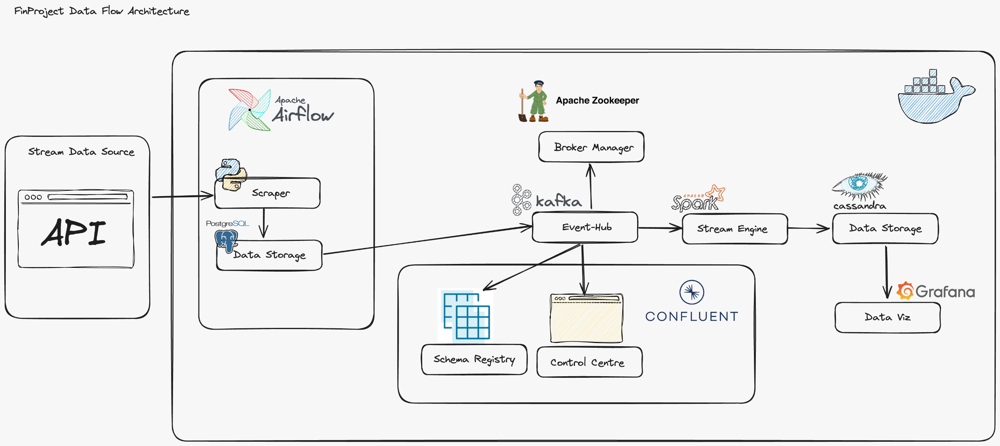
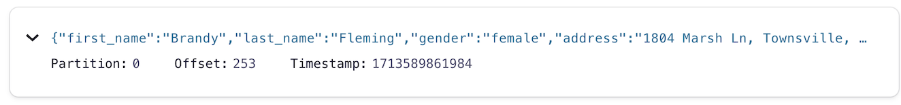

# STREAM FAKE DATA WITH AIRFLOW SCHEDULER
This project aims to analyze the population distribution of a area. In its development, the project utilizes streaming processing methods, where incoming data is generated by a fake stream for simulation.

## Project Stack
The project is built using the following:


### Fake Stream Data

The description of each item of the data:

- user_id = Unique identifier number for fake user
- first_name = Firstname of fake user
- last_name = Lastname of fake user
- gender = Gender of fake user
- address = address of fake user
- city = city of fake user
- postcode = postcode from the address
- state = state from the address
- country = country from the address
- coordinates = exact coordinates of the address
- dob = fake user's date of birth
- age = fake user's age
- email = fake user's email
- registered_date = registered date of fake user
- phone = fake user's phone
- nat = national code 

## Tools

### 1. zookeeper

#### Image:
confluentinc/cp-zookeeper:7.4.0
#### Function: 
This container runs a ZooKeeper instance. ZooKeeper is a distributed coordination service that provides high availability and consistency for distributed applications. In this setup, it acts as a central registry for coordinating services like Kafka and Schema Registry.
#### 2. broker
### Image: 
confluentinc/cp-server:7.4.0
### Function: 
This container runs a Kafka broker. Kafka is a distributed streaming platform that enables high-throughput, low-latency publishing and subscribing to message streams. It acts as the core message bus for the system.
### 3. schema-registry

### Image:
confluentinc/cp-schema-registry:7.4.0
### Function:
This container runs a Confluent Schema Registry. This service stores and manages schemas for data used with Kafka. It ensures data compatibility between producers and consumers.
### 4. control-center

### Image: 
confluentinc/cp-enterprise-control-center:7.4.0
### Function: 
This container runs a Confluent Control Center. It's a web-based UI for monitoring and managing a Confluent platform deployment. This includes monitoring Kafka brokers, Schema Registry, and other components.
### 5. webserver

### Image:
apache/airflow:2.6.0-python3.9
### Command: webserver
### Function:
This container runs the Airflow web server. Airflow is a platform for orchestrating and scheduling workflows. In this context, it might be used to schedule data processing pipelines that utilize Kafka or other services.
### 6. scheduler

### Image: apache/airflow:2.6.0-python3.9
### Command:
bash -c "pip install -r ./requirements.txt && airflow db upgrade && airflow scheduler"
### Function: 
This container runs the Airflow scheduler. It's responsible for triggering workflows based on defined schedules or dependencies.
### 7. postgres

### Image: 
postgres:14.0
### Function:
This container runs a PostgreSQL database server. Airflow uses this database to store metadata about workflows, tasks, and other information.
### 8. spark-master

### Image:
bitnami/spark:latest
### Command: 
bin/spark-class org.apache.spark.deploy.master.Master
### Function:
This container runs the Apache Spark master node. Spark is a distributed processing engine for large datasets. The master node coordinates worker nodes and manages tasks within the Spark cluster.
### 9. spark-worker

### Image:
bitnami/spark:latest
### Command:
bin/spark-class org.apache.spark.deploy.worker.Worker spark://spark-master:7077
### Function:
These containers run Apache Spark worker nodes. They execute tasks distributed by the Spark master node and communicate with the master to report progress and results.
### 10. cassandra_db

### Image:
cassandra:latest
### Function: 
This container runs a Cassandra database server. Cassandra is a NoSQL database known for its high availability, scalability, and fault tolerance. While not directly involved with Kafka or Airflow in this configuration, it could potentially be used as a secondary data store or for other data persistence needs.

## Guide
1. Clone This Repo.
2. Run `docker-compose.yml`.

---
```
✔ Container grafana                                        Started                                                                                               0.2s 
 ✔ Container data-engineering-final-project-postgres-1      Started                                                                                               0.0s 
 ✔ Container zookeeper                                      Healthy                                                                                               0.0s 
 ✔ Container cassandra                                      Started                                                                                               0.0s 
 ✔ Container data-engineering-final-project-spark-master-1  Started                                                                                               0.3s 
 ✔ Container broker                                         Healthy                                                                                               0.0s 
 ✔ Container data-engineering-final-project-webserver-1     Healthy                                                                                               0.0s 
 ✔ Container schema-registry                                Started                                                                                               0.0s 
 ✔ Container data-engineering-final-project-scheduler-1     Started                                                                                               0.0s 
 ✔ Container data-engineering-final-project-spark-worker-1  Started                                                                                               0.2s 
 ✔ Container control-center                                 Created                                                                                              0.0s   
```

---

